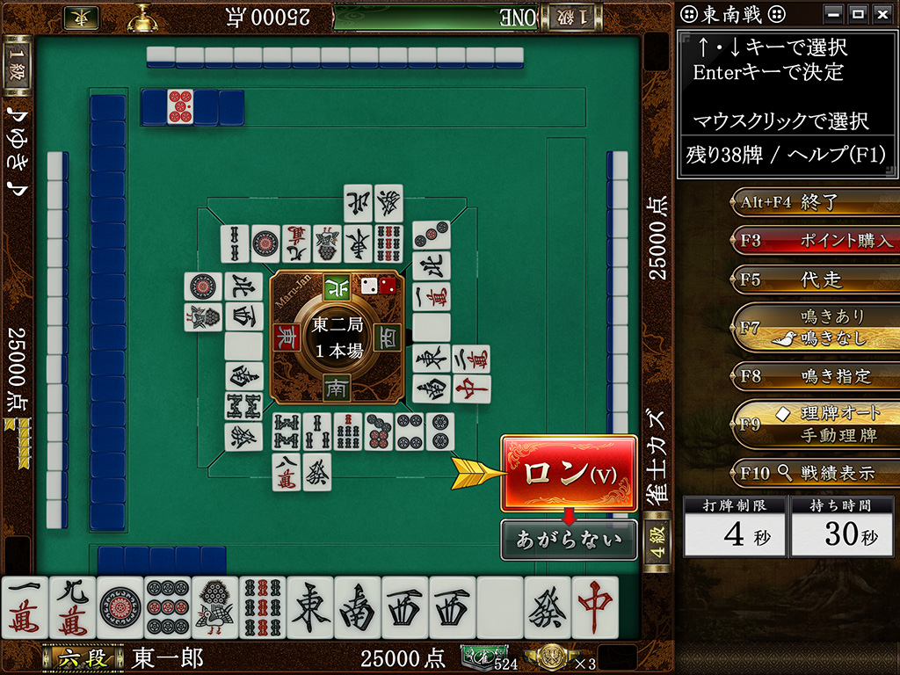
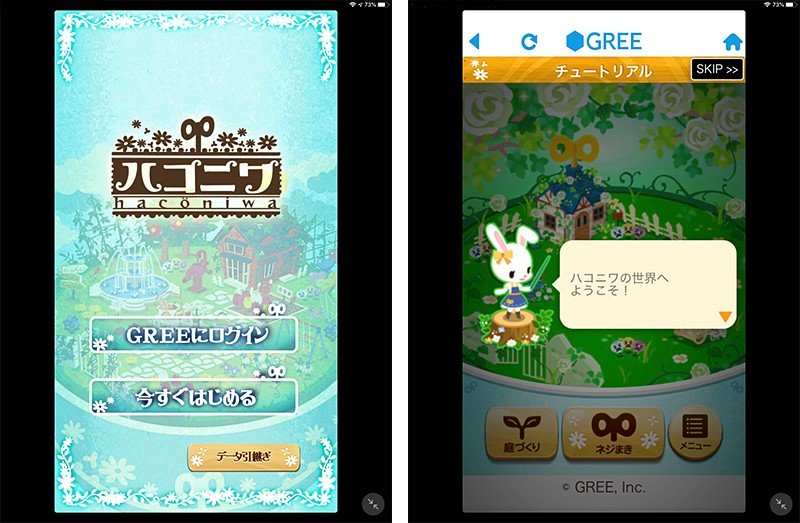
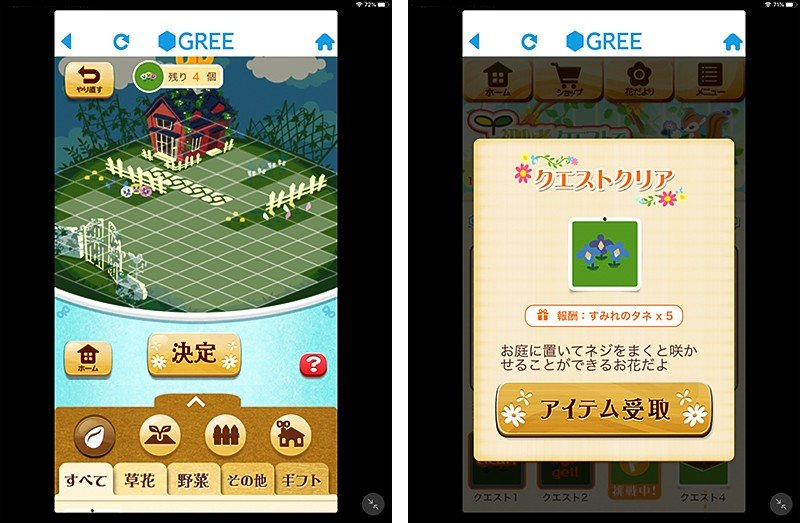
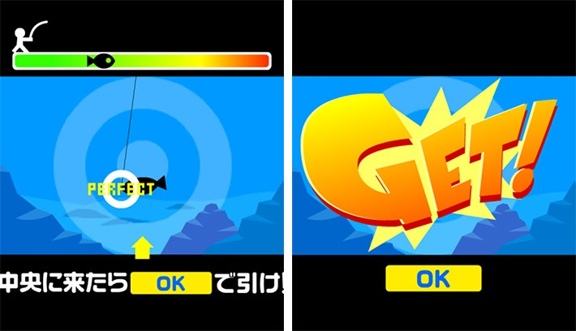

# 榎本 裕也 (Yuya Enomoto) | Portfolio

Facebook: <a href="https://www.facebook.com/variety.yeno">Yuya Enomoto Timeline</a> 

XR・AI・3DCGの領域を横断し、企画から開発・運用までを統括するプロデューサー/ディレクター。
技術的知見と体験デザインの両側面から、次世代コンテンツの戦略立案と実装を推進します 。

## 役職変遷
- [PL]：プランナー
- [開発D]：開発ディレクター
- [LD]：リードディレクター
- [PM]：プロジェクトマネージャー
- [イベントD]：イベントディレクター
- [P]：プロデューサー

---

## 経歴タイムライン

### 1. 株式会社シグナルトーク (2012年9月 〜 2019年1月)[PL]->[開発D]->[LD]

 

- **ポジション：事業戦略セクション リードディレクター** 年商約7億円規模のオンライン麻雀ゲームの新規企画・運営を統括 。
- **企画・運営統括**: 年間運営計画の策定、データ分析に基づくKPI管理 。
- **開発ディレクション**: スケジュール・仕様策定、開発・デザイン・QAチーム間の調整主導 。
- **メディア施策**: SNSやYouTubeを活用した広告戦略により、年間約1,000万円の追加利益を創出 。
---

### 2. グリー株式会社 (2019年2月 〜 2020年12月)[PM]

  
  

- **ポジション：Japan game 事業本部 PM** オンラインゲームの運営およびUI/UX改善、マーケティング戦略を推進 。
- **ゲーム運営**: サービス全体のKPI設計、継続率および課金率向上のためのイベント立案・実行 。
- **UI/UX設計**: ユーザー離脱率改善のため、ゲーム内導線やチュートリアルの再構築、プロトタイプ制作 。
- **マーケティング**: 運用型広告の統括とPDCAサイクルの確立によるROIの最大化 。
---

### 3. monoAI technology株式会社 (2021年1月 〜 2025年5月)[イベントD][P]

- **ポジション：XRソリューション開発事業部 プロデューサー** AI、XR、メタバース領域における全体プロデュースを統括 。
- **AI研究開発**: 大学との共同研究にて、Text to Motion / Motion to TextのAI学習基盤モデルを設計 。
- **VR/AR/MR導入支援**: 企業・教育機関向け研修、販促、シミュレーション用アプリの企画・開発 。
- **メタバースイベント**: Unityを用いた自社/OEMプラットフォームでのイベント構築、IPタイアップ企画の主導 。
---

### 4. スマートエンジニア株式会社 (2025年6月 〜 在職中)

- **ポジション：VISUS & Co. プロデューサー** 3DCGソリューションを活用した自動車販促およびスポーツビジネスを推進  
- **車両販促コンテンツ**: 3DCGシミュレーションを用いた体験的な販促施策の設計 。
- **販促動画制作**: Unreal Engineを用いたフォトリアルな高品質映像制作のリード 。
- **スポーツ×3DCG**: 試合演出やAR体験を通じたファンエンゲージメント強化と、新たなマーケティング枠組みの確立 。
- **ビジネスプロデュース**: スポンサーシップ企画の構築、年間運用計画、ROI評価設計 。
---

## スキル・専門領域
- **ゲーム企画・運営**: オンラインゲーム(スマホ・PC)の運営・企画開発・UI/UX設計、ROI改善、ユーザーオンボーディング設計
- **XRコンテンツ**: Unity/Unreal Engineを用いたVR/AR/MR体験設計 
- **生成系AI**: AI基盤モデルの研究開発、プロンプト設計、AIエージェント活用ビジネス提案 
- **3DCGシミュレーター**: 高精度ビジュアルと軽量化を両立したシミュレーター開発 
- **プロダクトマネジメント**: 複数企業間の共同開発、要件定義、ロードマップ策定、開発管理 
- **デジタルマーケティング**: KPI分析に基づくUX改善、広告運用（ROI最大化） 
---

## 学歴・資格
- **学歴**: 北海道函館中部高等学校 卒業　(札幌大学 中途退学 (2012年3月)) 
- **語学**: 英語 (実用英語技能検定2級、オフショア開発での実務経験あり) 

---

<!--
**EN-Office/EN-Office** is a ✨ _special_ ✨ repository because its `README.md` (this file) appears on your GitHub profile.

Here are some ideas to get you started:

- 🔭 I’m currently working on ...
- 🌱 I’m currently learning ...
- 👯 I’m looking to collaborate on ...
- 🤔 I’m looking for help with ...
- 💬 Ask me about ...
- 📫 How to reach me: ...
- 😄 Pronouns: ...
- ⚡ Fun fact: ...
-->

